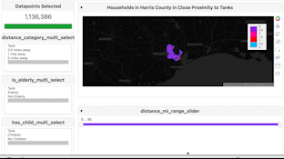
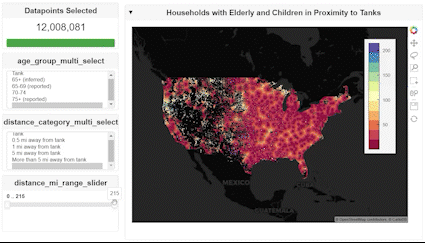

# Visualization in Python for Duke Data Scientists

# Authors: Alyssa Ting, Susan Feng, Joey Nolan






## Project Introduction 

This project was part of the 2022 Duke University Code+ Program. The primary goal of this project was to develop interactive visualization tools and workflows to help Duke researchers analyze and visualize their large datasets. The visualizations developed and documented for this project were created using Holoviews, Datashader, and Dask in JupyterLab notebooks that were hosted in OnDemand sessions on the Duke Compute Cluster.  

## Our Researcher

Celine Robinson is a 4th year Ph.D candidate in Civil and Environmental Engineering at Duke concentrating in Systems, Risk and Decision. Her research is focusing on how various natural disasters can affect petrochemical tanks and the risk of those tanks spilling into nearby neighborhoods. Our project was to create visualizations to her data to help her assess such variables and risks.

## About the Data

Our researcher Celine has provided us with several datasets including the infousa census dataset, the AST (above ground storage tank) data, and several natural hazard datasets. 

### Infousa Data

The infousa data covers household demographic data, containing variables on household age, location, children, housing type, income, and more. The infousa data we were provided  contained around 38,248 files; each file includes data for one zip code in the US. In looking at the specific variables we used, we focused on the longitude and latitude coordinates of each household, age code, and children variables because Celine’s research focuses on how petrochemical tank spillage will affect neighboring houses with children and elderly in particular. 

### AST Data

The AST data was collected by Celine and her team; this data set provides information on all of the above ground storage tanks in the United States, totalling to around 98,000 tanks. This information includes tank type, diameter, longitude and latitude coordinates of the tanks. In our visualizations, we focused primarily on the longitude and latitude coordinates, which allowed us to precisely plot each tank and analyze tank distance to risks and households.

### National Risk Index Data, available at https://hazards.fema.gov/nri/data-resources

This dataset was made publicly available by the Federal Emergency Management Agency (FEMA), and contains extensive information on natural hazards risks for each county across the country. The columns we were specifically interested in were the ones with Risk Index Score values for each county. The Risk Index Score is on a scale from 0 to 100, and was calculated by FEMA and indicates the relative risk of that county for a specific natural hazard. The natural hazards deemed relevant to our project by our researcher were tornadoes, hurricanes, strong winds, coastal floods, riverine floods, and earthquakes.

[INSERT SCREENSHOT OF DATA]

### Floodplain Data, available at https://www.fema.gov/flood-maps/national-flood-hazard-layer

This dataset was made publicly available by FEMA, and contains information, including geometries, of over one million floodplains across the US. We specifically used the geometries provided to identify which tanks were on floodplains.

[INSERT SCREENSHOT OF DATA]


## Our Tools
### Data manipulation and processing: Pandas, GeoPandas, and NumPy
**Pandas:** an open-source Python library that provides an easy and intuitive way to read, process, and write data. We use Pandas to read in our data from ```.csv```, ```.txt``` or ```.parquet``` files as a dataframe, then manipulate this dataframe through a variety of easy-to-use tools provided by the library. 

**GeoPandas:** an open-source Python library specifically focused on working with geospatial data. It provides much of the same functionality for manipulating and processing data as the Pandas libraries, but allows users to work with geospatial data (like points and geometries). We use GeoPandas to manipulate our spatial data in order to create visualizations.

**NumPy:** an open-source Python library used for scientific computing. It allows for fast and easy manipulation of data through the use of arrays. We use NumPy to process and manipulate a lot of our data before we visualize it through GeoPandas or the Cuxfilter libraries.

### Visualizations: HoloViews and GeoViews
**HoloViews:** an open-source Python library specializing in data analysis and visualization. It incorporates visualization tools like bokeh and matplotlib to allow users to work seamlessly with the data and its visualization. We use it in order to process and visualize our large amounts of data, as it provides an immediate, automatic visualization rendered by a variety of supported plotting libraries, including Bokeh or Matplotlib.

**GeoViews:** an open-source Python library built on the HoloViews library allowing users to easily visualize multidimensional and geographical data. We use it to plot and visualize geographical data, such as to map tanks and households across the US.

### Visualizations using Graphical-Processing Units (GPUs): Cuxfilter
**Cuxfilter:** an open-source Python library, part of the RAPIDS suite of open-source software libraries built to work with data science on GPUs. This specific library seamlessly connects different visualization libraries such as bokeh and datashader and a GPU dataframe. We use this library to plot amounts of data orders of magnitudes larger than that we plot on HoloViews and GeoViews, all within seconds.


## Data Merging and Wrangling Workflow Overview

#### If you would like a more detailed overview of each demo, please look at the more in-depth [README](https://gitlab.oit.duke.edu/sf282/code-plus-celine/-/blob/master/file_processing/README.md)


### Merging InfoUSA Data
In the infousa dataset, we are provided around 38,000 zip code files for the year 2020. Each file includes demographic data for a specific zip code in the US. Therefore, in order for us to plot visualizations for Celine’s counties of interest, Charleston and Houston County, or visualizations of the entire United States, we had to merge these zip code files together; this process will be documented in the merging infousa processing file. 

### Filtering through Above-Ground Storage Tanks Data
The above-ground storage tank (AST) data includes around 98,000 tanks in the US. Some of the key columns in this dataset were the longitude and latitude coordinates of the four corners of each tank. The other columns we focused on were tank type, state of tank, and tank geometries, and the outputted dataframe included these columns with the longitude and latitude coordinates transformed into 3857 projections. 

### Number of Children per County
We have a processing file that creates a dataframe with the number of children in the households of each county. We wanted to have a dataframe containing this information so that we can make county level visualizations and display how many children there are per county on a map. In order to make this visualization, we will need geometries of the counties; we found a shapefile online that gives us county geometry. After a number of merges and manipulations, the resulting data frame from this file processing includes zip code, county, state, and the total number of children in that county.

### Merging Risk and AST Data
In our visualizations, we also wanted to look at the risk factors the different natural hazards have on tanks. We were given the NRI hazards data, which included risk indexes for seven different hazards. Since these risk indexes corresponded to a certain county in the US, we needed to categorize each tank by county so that we can assign a natural hazard risk to a tank. To do so, we used spatial joins in which we took a shapefile with county geometries, and checked to see if a tank’s coordinate landed in that county’s polygon. Now, we have a dataframe that includes tank coordinates, county classification, along with the hazards risk associated with each tank.

### Calculating Distances Between Households and Tanks for All Households in US
In Celine’s research, one of her focuses is how the surrounding neighborhoods near tanks would be affected due to tank spillage. Thus, we wanted to find the distances between each household and the tank nearest to it. Using the sklearn ball tree machine learning method, we were able to do just that. Having now found the lon/lat coordinates of the nearest tanks to each household, we are able to calculate the distance between the two sets of coordinates using the haversine distance method, which returns us distance in miles (it first returns as meters but we convert it to miles).

### Household and Tank Distances for Case Studies
We also wanted to visualize household and tank distance more in depth for Charleston and Harris Counties. In this file processing, we have made a dataframe that includes household and tank longitude and latitudes, distances between households and tanks, if there are elderly in the household, and if there are children in the household. This will allow us to plot these variables in a dashboard with multiselect and range slider features. 

### Household Count by County
In this file processing, we wanted to classify the households in terms of the counties they are in (infousa households come in the form of zip codes) so that we could calculate the total household counts by county. In this file, we were able to loop through each of the counties and households to classify by county, and then grouped by county to get the sums of the household counts.

### Natural Hazards Breakdown and Merging
We also wanted to include natural hazard risk in our visualization of tank proximity and households. Earlier, we talked about classifying tanks by county so that we can merge the tank data with the NRI hazard data. In this output dataframe, we have now merged that dataframe with the household longitude and latitude coordinates so that we can plot tanks and households in the same dashboard. We have included the transformed (3857) and untransformed (4326) coordinates as well as the 6 different risk indexes (hurricanes, earthquakes, tornados, strong wind, coastal flooding, and riverine flooding). 


## Visualizations

#### If you would like a more detailed overview of each demo, please look at the more in-depth [README](https://gitlab.oit.duke.edu/sf282/code-plus-celine/-/blob/master/demos/README.md)


### Stacked Bar Graph of Tank Types per State
This visualization displays the distribution of the different types of tanks for every state through a stacked bar chart. For each state, there is a color coded breakdown of tank type with a key at the top right corner indicating which color correlates to which tank type. This visualization is helpful if you want to look at the different tank types that are popular or unpopular within a state. 


### Number of Children Per County
This map is a non-gpu visualization that shows a breakdown of the US by county, with each county being shaded differently based on the number of total children within that county. In this visualization, we also plotted the tanks over the county breakdowns. 

### Map Colored by Number of Households Within 5mi of a Tank
This map is a non-gpu map that is shaded by the number of households within 5mi of a tank. This is helpful because the user can look at which counties have more households closer to tanks, which is important in identifying which areas are in potential risk zones if a petrochemical tank does spill. 


### Charleston County Case Study
This Charleston County visualization is a gpu cuxfilter dashboard with a zoom in of all of the households and tanks in Charleston County plotted on a map. On the sides of the dashboard, there are multi select features to display whether or not a household contains elderly people and whether or not households are within a certain distance range of a tank. We also included a distance range slider so that users can look at households a specific distance range away from a tank.

### Harris County Case Study
For this visualization, we took the same steps as the ones described above, the exception being that we used a different pre-processed file with households in Harris County. Our output visualization also contains the same multiselect and sliding features as the Charleston County case study map.

### Map of All US Households Plotted and Colored by Distance to Nearest Tank
This visualization is also similar to the ones mentioned above. Here, we have a map of the United States with all of the households that have elderly and children plotted. We also have all the tanks plotted in a different color as well. On the side, we have the elderly age category multiselect and the distance to tanks range slider.

### Maps of All US Households Colored by Distance to Nearest Tank with Natural Hazard Sliders
These visualizations display a map of the US with all households containing elderly and children as well as all of the tanks in the US. On the side, there is a natural hazard risk range slider for a specific risk. We thus have made these visualizations for each of the 6 natural hazard risks: hurricanes, earthquakes, tornados, strong wind, coastal flooding, and riverine flooding. These range sliders allow users to look at households with a specific risk index to a certain natural hazard. We also have included the distance range slider so that users can also look at households a specific distance range away from a tank. This is helpful because tanks and households close to each other will oftentimes be associated with the same risk index. 


### Address Lookup Web App
This is a web app that allows users to type in an address anywhere in the US, and the web app will output how far away (in miles) the nearest petrochemical tank is from the input location. The natural disaster risk index of the nearest location will also be displayed on the screen along with a detailed zoomed in map of the input location and the ten closest tanks. 


## User Instructions
### Step 1: Setup environment for project in the Duke Compute Cluster
Create a JupyterLab Singularity instance in an OnDemand session with or without GPUs and the amount of time, CPU cores (max is 40 cores), and RAM (max is 208 GB), depending on which visualizations you want to run. Only visualizations that require GPUs (such as our Worldwide Reddit Post Activity visualization) will need gpu-scavenger or gpu-common as the partition. Make sure to ask for GPUs (max of 2) if you want to run a GPU visualization.

### Step 2: Clone Gitlab repository
Copy the following command into your terminal once you are inside the directory you want this project folder to be in:

```git clone git@gitlab.oit.duke.edu:sf282/code-plus-celine.git```

### Step 3: Open JupyterLab Notebooks + Run Code
Once the repository has been cloned, you can open the JupyterLab notebooks and begin running the code. For any visualizations that need GPUs to run, make sure under the Kernel tab that the rapids kernel is selected (should be selected by , otherwise, select the Python 3 kernel. 

If you encounter any issues with a Python library not being available/up-to-date/compatible, you can go to your terminal and run the command pip install “name of library” and that should install the library.